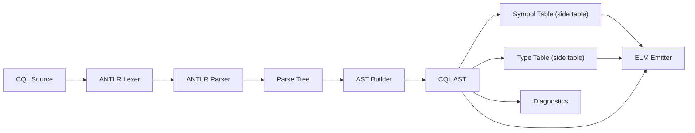
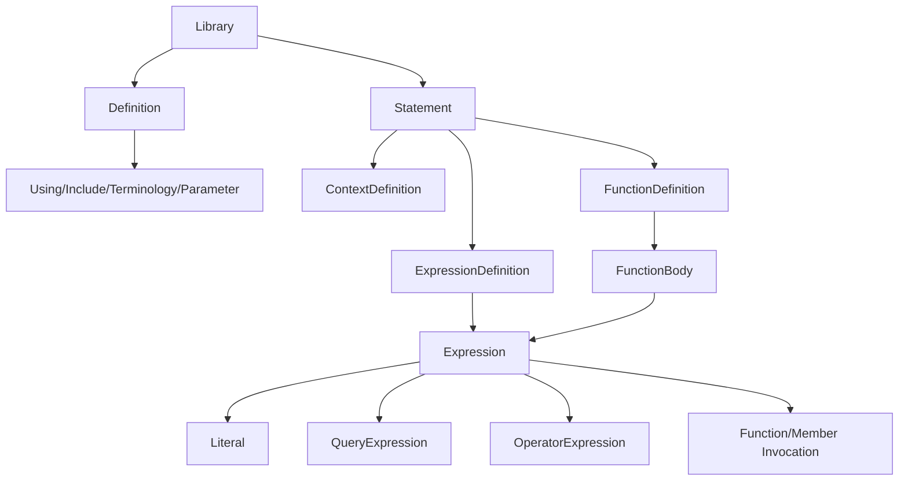

# CQL AST Design

This document describes the current CQL AST design and its role in the compiler
frontend. It complements [ADR 003](../docs/DECISIONS.md#adr-003-cql-ast-representation)
and functions as the design reference for the implementation under `cql/src/commonMain/kotlin/org/hl7/cql/ast`.

## Goals and Principles

The AST exists to separate frontend concerns (parsing, validation, type inference,
and CQL-specific rewriting) from backend concerns (ELM generation). Key design elements:

* **Separation of concerns:** parsing and ELM emission are distinct phases; ELM
  generation can become a mostly mechanical transform once the AST is validated
  and typed. This simplifies maintenance and improves testability.
* **Isomorphic to syntax:** the AST mirrors the grammar closely so that tooling
  can reason about CQL syntax (not just ELM semantics).
* **Side tables for Symbols and Types:** semantic metadata is stored alongside
  the AST rather than embedded directly in nodes. This allows multiple analyses over the
  same AST, allows analyses to be updated without mutating the AST, and allows new types
  of metadata to be added without changing node definitions. This enables whole new classes
  of analyses to be built externally and extensibly (e.g. data flow analysis, cost estimation, etc.)
  without modifying the core AST structure.
* **Immutable, serializable nodes:** nodes are Kotlin data classes with `val`
  fields and `kotlinx.serialization` discriminators (`kind`), enabling stable
  sharing and tooling across JVM/JS/WASM.
* **Deterministic source mapping:** every node carries a `Locator` for precise
  diagnostics and editor integration. ELM may or may not preserve these mappings, depending on compiler options.

Collectively, these principles enable a modular, extensible compiler frontend
that can support evolving CQL syntax and tooling needs:

* **Multiple language versions:** a CQL-first AST allows rewrites that preserve
  stable ELM output while supporting evolving CQL syntax (e.g., CQL 2.0
  changes that reduce or remove reliance on ModelInfo). This allows ELM to evolve into a stable, long-term
  IR without needing to add first-class support for every CQL syntax change.
* **Tooling support:** earlier compiler stages are more useful
  for IDE features. For example, certain features like autocomplete of syntax (`on or before end of`) can't be
  reliably implemented at the ELM level, since ELM omits syntactic details.
* **Alternate backends:** Separating parsing and analysis to consolidate "frontend" logic from "backend" logic
  allows alternative backends (e.g., direct execution, translation to SQL or)
  other query languages, .NET or native code generation, etc.) to reuse the same
  frontend passes.

## Frontend Architecture



The parse tree is treated as an immutable input. The AST builder constructs a
new, immutable tree from it and returns syntax errors as `Problem` entries
alongside the AST. Semantic passes (name resolution, type inference, overload
resolution, and rewriting) operate over the AST and populate side tables.

This design is still provisional, and some details may evolve as the AST is completed and type inference and ELM generation are implemented.

## AST Shape

At a high level, the AST mirrors the top-level grammar structure (definitions
precede statements, matching `library: definition* statement*` in the grammar):



The core families are:

* **Library**: name, version, definitions, and statements.
* **Definitions**: `using`, `include`, code system/value set/code/concept, and
  parameters (parameter defaults can include expressions).
* **Statements**: context definitions, expression definitions (`define`), and
  function definitions. Only expression/function definitions contain expressions.
* **Expressions**: function/member calls, operators, queries, and literals.
* **Types**: named, list, interval, tuple, and choice type specifiers.

Visitor helpers (`AstWalker`, `Transformer`) support read-only traversal and
structural rewriting without mutating the original nodes.

## Node Inventory (by file)

AST nodes live under `cql/src/commonMain/kotlin/org/hl7/cql/ast`. This table is
intended as a quick map of available node types.

| File                              | Nodes                                                                                                                                                                                                                                                                                                                                                                                                                                                                     |
|-----------------------------------|---------------------------------------------------------------------------------------------------------------------------------------------------------------------------------------------------------------------------------------------------------------------------------------------------------------------------------------------------------------------------------------------------------------------------------------------------------------------------|
| `Library.kt`                      | `Library`, `Definition` (`UsingDefinition`, `IncludeDefinition`, `CodeSystemDefinition`, `ValueSetDefinition`, `CodeDefinition`, `ConceptDefinition`, `ParameterDefinition`, `UnsupportedDefinition`), `OperandDefinition`, `FunctionBody` (`ExpressionFunctionBody`, `ExternalFunctionBody`), `TerminologyReference`                                                                                                                                                     |
| `Statements.kt`                   | `Statement` (`ContextDefinition`, `ExpressionDefinition`, `FunctionDefinition`, `UnsupportedStatement`)                                                                                                                                                                                                                                                                                                                                                                   |
| `Expressions.kt`                  | `Expression` nodes (`IdentifierExpression`, `ExternalConstantExpression`, `FunctionCallExpression`, `PropertyAccessExpression`, `IndexExpression`, `IfExpression`, `CaseExpression`, `IsExpression`, `AsExpression`, `CastExpression`, `ExistsExpression`, `MembershipExpression`, `ListTransformExpression`, `ExpandCollapseExpression`, `UnsupportedExpression`), plus `MembershipOperator`, `ListTransformKind`, `ExpandCollapseKind`, `CaseItem`, `TupleElementValue` |
| `BinaryExpressions.kt`            | `BinaryOperator`, `OperatorBinaryExpression`                                                                                                                                                                                                                                                                                                                                                                                                                              |
| `UnaryExpressions.kt`             | `UnaryOperator`, `OperatorUnaryExpression`                                                                                                                                                                                                                                                                                                                                                                                                                                |
| `TemporalExpressions.kt`          | Temporal operators (`BetweenExpression`, `DurationBetweenExpression`, `DifferenceBetweenExpression`, `DurationOfExpression`, `DifferenceOfExpression`, `WidthExpression`, `ElementExtractorExpression`, `TypeExtentExpression`, `DateTimeComponentExpression`, `ConversionExpression`, `TimeBoundaryExpression`) and interval phrases (`IntervalRelationExpression` and phrase/enumeration types)                                                                         |
| `QueryExpressions.kt`             | `QueryExpression`, `QuerySource` (`RetrieveExpression`, `ExpressionQuerySource`), `AliasedQuerySource`, `LetClauseItem`, `QueryInclusionClause` (`WithClause`, `WithoutClause`), `AggregateClause`, `ReturnClause`, `SortClause`, `SortByItem`                                                                                                                                                                                                                            |
| `Literals.kt`                     | `Literal` subtypes (`StringLiteral`, `IntLiteral`, `LongLiteral`, `DecimalLiteral`, `BooleanLiteral`, `NullLiteral`, `QuantityLiteral`, `DateTimeLiteral`, `TimeLiteral`, `TupleLiteral`, `InstanceLiteral`, `IntervalLiteral`, `ListLiteral`, `RatioLiteral`, `CodeLiteral`, `ConceptLiteral`) and `LiteralExpression`                                                                                                                                                   |
| `Types.kt`                        | `TypeSpecifier` subtypes (`NamedTypeSpecifier`, `ListTypeSpecifier`, `IntervalTypeSpecifier`, `TupleTypeSpecifier`, `ChoiceTypeSpecifier`) and `TupleElement`                                                                                                                                                                                                                                                                                                             |
| `Identifiers.kt`                  | `Identifier`, `QualifiedIdentifier`, `VersionSpecifier`, `AccessModifier`                                                                                                                                                                                                                                                                                                                                                                                                 |
| `Locator.kt`                      | `AstNode`, `Locator`, `Problem`, `ProblemSeverity`, `LibraryResult`, `ExpressionResult`                                                                                                                                                                                                                                                                                                                                                                                   |
| `AstWalker.kt` / `Transformer.kt` | traversal and rewrite helpers                                                                                                                                                                                                                                                                                                                                                                                                                                             |

## Syntax Correspondence and Normalization

The AST is intentionally close to the grammar in `../grammar/cql.g4`, but it
normalizes a few cases to simplify downstream analysis:

* **Numeric literals:** grammar rules like `NUMBER` and `LONGNUMBER` become
  `IntLiteral`, `LongLiteral`, or `DecimalLiteral` based on value shape.
* **Date literals:** both `DATE` and `DATETIME` grammar productions map to the
  single `DateTimeLiteral` node (with the original text preserved).
* **Literal unification:** literal forms (tuple/list/instance/interval/code/
  concept) are normalized as `LiteralExpression` with a specific `Literal`
  subtype.
* **Operator normalization:** arithmetic/boolean operators are modeled with
  `OperatorBinaryExpression` and `OperatorUnaryExpression` enums rather than
  parser rule variants.
* **Interval relationships:** temporal phrases are normalized into
  `IntervalRelationExpression` with structured phrase nodes, rather than
  leaving them as raw parse-tree alternatives.

These deviations preserve a close mapping to syntax while providing a stable
semantic surface for the frontend and ELM emitter.

## Symbols and Types as Side Tables

Symbol and type information are intentionally kept out of AST nodes. Instead,
semantic passes attach metadata in side tables keyed by AST node identity
(or other stable handles, such as locators or traversal indices).

Recommended keying strategies:

* **In-process analysis:** use node identity (e.g., `IdentityHashMap`) to map
  nodes to symbols and inferred types.
* **Cross-process tooling:** use stable keys derived from `Locator` plus node
  kind (e.g., `sourceId`, `startIndex`, `stopIndex`, `kind`) when the AST is
  serialized and reloaded.

Advantages for analysis and tooling:

* **Immutability preserved:** no mutation or extension of AST nodes is required.
* **Multiple analyses can coexist:** different tooling layers can maintain
  independent symbol/type environments for the same AST.
* **Incremental updates:** tools can update side tables without rebuilding the
  AST or invalidating serialized forms.
* **Cleaner testing:** frontend passes can be unit tested by comparing AST +
  tables without touching ELM output.

## Tradeoffs and Alternatives

Side tables introduce indirection and require careful invalidation when AST
structure changes. In-place annotation (embedding inferred types or symbols on
nodes) can be more direct, but it reduces portability (especially across
KMP targets), complicates serialization, and makes it harder to keep multiple
views of the same AST in tooling.

The current design favors immutability and portability over minimal allocation.

## Parsing Example

Example input:

```cql
library Demo version '1.0.0'
using FHIR version '4.0.1'

define Foo: 1 + 2
```

Resulting AST structure (simplified):

* `Library`
  * `name = QualifiedIdentifier(["Demo"])`
  * `version = VersionSpecifier("1.0.0")`
  * `definitions = [UsingDefinition(modelIdentifier = ["FHIR"], version = "4.0.1")]`
  * `statements = [ExpressionDefinition(name = "Foo", expression = OperatorBinaryExpression)]`
    * `OperatorBinaryExpression(operator = ADD)`
      * `left = LiteralExpression(IntLiteral(1))`
      * `right = LiteralExpression(IntLiteral(2))`

Note the normalization: the `NUMBER` grammar token is mapped to `IntLiteral`
because the literal has no decimal point or exponent.

## References and Archetypes

* [ADR 003: CQL AST Representation](../docs/DECISIONS.md#adr-003-cql-ast-representation)
* Kotlin compiler PSI/FIR documentation (syntax-first tree plus separate
  semantic layers).
* Roslyn Syntax Trees (immutable syntax nodes + semantic model).
* TypeScript Compiler API (AST + symbol/type checker).
