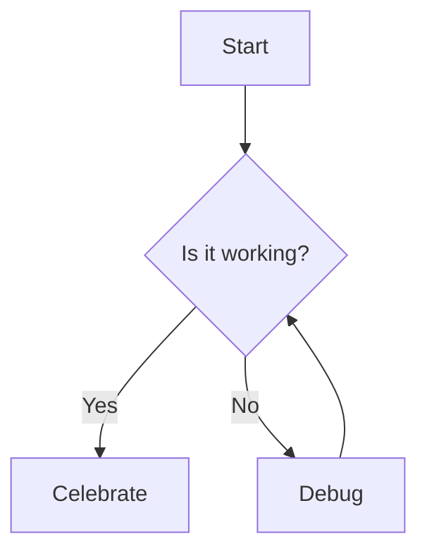

# Developer Documentation

## Conventions

* High-level or cross-cutting developer documentation: this `docs/` directory.
* Key design decisions: the [Decisions](DECISIONS.md) file.
* Code snippets: [src/test/kotlin](src/test/kotlin) directory.
  * Snippets are compiled as part of the build to ensure they stay fresh.
  * Mark snippet regions in test code with `// BEGIN:snippet-name` and `// END:snippet-name`
  * Reference in Markdown with `<!-- SNIPPET:snippet-name -->`
  * The `buildDocs` task extracts and injects snippets automatically.
  * See [Snippets](#Snippets) for an example.
* Diagrams: Use [Mermaid](https://mermaid-js.github.io/mermaid/#/) syntax in Markdown files.
  * GitHub can render Mermaid diagrams natively in Markdown files.
  * See [Mermaid Live Editor](https://mermaid.live/) for previewing diagrams.
  * See [Diagrams](#Diagrams) for an example.
* Module-specific design/dev documentation: in their respective module directories, typically in a `README.md` file.
  * Use `README.md` as the entry point for module docs.
  * Use specific Markdown files for larger topics as needed. E.g., `ARCHITECTURE.md`, `INSTALLATION.md`, etc.
  * These files will be copied into the assembled docs site under `modules/`.
* API/Code documentation: generated Javadoc/KDoc
  * public classes and methods should have comprehensive Javadoc/KDoc comments.
  * private/internal classes and methods should have concise comments explaining non-obvious logic.

## Site Build

Documentation is assembled and published via GitHub Pages:

1. **Source**: Markdown lives close to code (this `docs/` folder + module READMEs)
2. **Build**: `./gradlew buildDocs` assembles the site into `build/site/`:
   - Copies cross-cutting docs from `docs/`
   - Copies module `README`s (and other Markdown) into `modules/`
   - Extracts and injects code snippets
   - Generates an index with navigation
3. **Deploy**: GitHub Actions pushes `build/site/` to the `gh-pages` branch
4. **Serve**: GitHub Pages runs Jekyll to render Markdown as HTML

## Snippets

Basic CQL translation:

<!-- SNIPPET:basic-translation -->

## Diagrams

Example Mermaid diagram:

